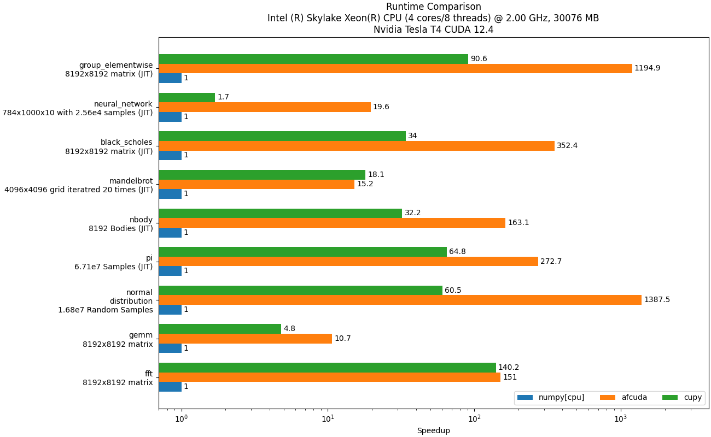
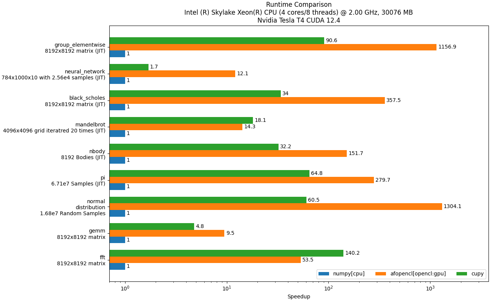
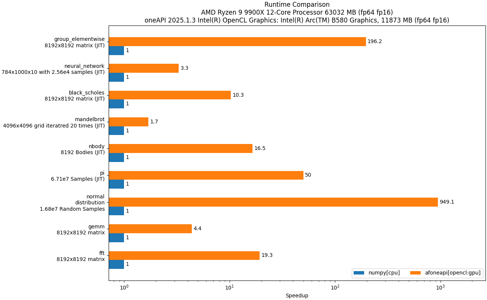

# arrayfire-py (WIP)
<p align="center"><a href="http://arrayfire.com/"></a></p>

[ArrayFire](https://github.com/arrayfire/arrayfire) is a high performance library for parallel computing with an easy-to-use API. It enables users to write scientific computing code that is portable across CUDA, OpenCL and CPU devices.  

This project is a **work in progress**. It is meant to provide thin Python bindings for the ArrayFire C library, i.e, it provides array functionality, math operations, printing, etc. This is the front-end python library for using ArrayFire.


This project is separated into 3 different parts:
```
arrayfire-py -> arrayfire-binary-python-wrapper -> ArrayFire C Libraries
```
The arrow `->` means `uses/depends on`. This means that arrayfire with python each of these parts is needed:
- [`arrayfire-py`](https://github.com/arrayfire/arrayfire-py) is the `thin` wrapper that provides the numpy-like interface to do math and array operations. *** This is the intended User Interface ***
- [`arrayfire-binary-python-wrapper`](https://github.com/arrayfire/arrayfire-binary-python-wrapper) is the `binary` wrapper that provides rough direct access to the functions in the C library. Its purpose is to do the handling of finding the C libraries and handling the communication between Python and C datatypes. This package can exist in two forms, with a bundled binary distribution, or merely as a loader that will load the ArrayFire library from a system or user level install.
- [`ArrayFire C Libraries`](https://github.com/arrayfire/arrayfire) are the binaries obtained from compiling the [ArrayFire C/C++ Project](https://github.com/arrayfire/arrayfire)

The main reason for this separation has to do with handling updates. Bug fixes and features for user-interface and python functionality will only require updating `arrayfire-py`, updates for the communication between Python and C will require only updating `arrayfire-binary-python-wrapper`, and updates to the internal math operations, device handling, speedup, etc will only require updating the `ArrayFire C Libraries`. This way we allow the user to customize their own ArrayFire installation (e.g. only requiring the cuda backend, using both oneapi and opencl, etc.). As we continuously update each of the components, updating one of the wrapper will not force the user to reinstall the heavy binaries, and doing updating the binaries will not necessarily force the user update the python interface they are using through `arrayfire-py`.

# Installing

The arrayfire-py can be installed from a variety of sources or can be easily and quickly built from source:


**Install the last stable version of python wrapper:**
```
pip install arrayfire-py
```

**Install a pre-built wheel:**
```
pip install arrayfire-py -f https://repo.arrayfire.com/python/wheels/arrayfire-py/0.1.0
```

# Building
Building this interface is straight forward using [scikit-build-core](https://github.com/scikit-build/scikit-build-core):
```
python -m pip install -r dev-requirements.txt
python -m build --wheel
```

**Note: Building this project does not require the arrayfire-binary-python-wrapper package; however, the binary wrapper is needed to run any projects with it**

# Running Tests

Tests are located in folder [tests](tests).

To run the tests, use:
```bash
python -m pytest tests/
```

# Benchmarks
Here are some graphs comparing ArrayFire Python against other packages for some common operations:

<p align="center"></a></p>
<p align="center"></a></p>
<p align="center"></a></p>

These graphs were generated with this benchmark code using the ArrayFire C Libraries v3.10

# Contributing

If you are interested in using ArrayFire through python, we would appreciate any feedback and contributions.

The community of ArrayFire developers invites you to build with us if you are
interested and able to write top-performing tensor functions. Together we can
fulfill [The ArrayFire
Mission](https://github.com/arrayfire/arrayfire/wiki/The-ArrayFire-Mission-Statement)
for fast scientific computing for all.

Contributions of any kind are welcome! Please refer to [the
wiki](https://github.com/arrayfire/arrayfire/wiki) and our [Code of
Conduct](33) to learn more about how you can get involved with the ArrayFire
Community through
[Sponsorship](https://github.com/arrayfire/arrayfire/wiki/Sponsorship),
[Developer
Commits](https://github.com/arrayfire/arrayfire/wiki/Contributing-Code-to-ArrayFire),
or [Governance](https://github.com/arrayfire/arrayfire/wiki/Governance).

# Citations and Acknowledgements

If you redistribute ArrayFire, please follow the terms established in [the
license](LICENSE).

ArrayFire development is funded by AccelerEyes LLC and several third parties,
please see the list of [acknowledgements](ACKNOWLEDGEMENTS.md) for an
expression of our gratitude.

# Support and Contact Info

* [Slack Chat](https://join.slack.com/t/arrayfire-org/shared_invite/MjI4MjIzMDMzMTczLTE1MDI5ODg4NzYtN2QwNGE3ODA5OQ)
* [Google Groups](https://groups.google.com/forum/#!forum/arrayfire-users)
* ArrayFire Services:  [Consulting](http://arrayfire.com/consulting)  |  [Support](http://arrayfire.com/download)   |  [Training](http://arrayfire.com/training)

# Trademark Policy

The literal mark "ArrayFire" and ArrayFire logos are trademarks of AccelerEyes
LLC (dba ArrayFire). If you wish to use either of these marks in your own
project, please consult [ArrayFire's Trademark
Policy](http://arrayfire.com/trademark-policy/)
