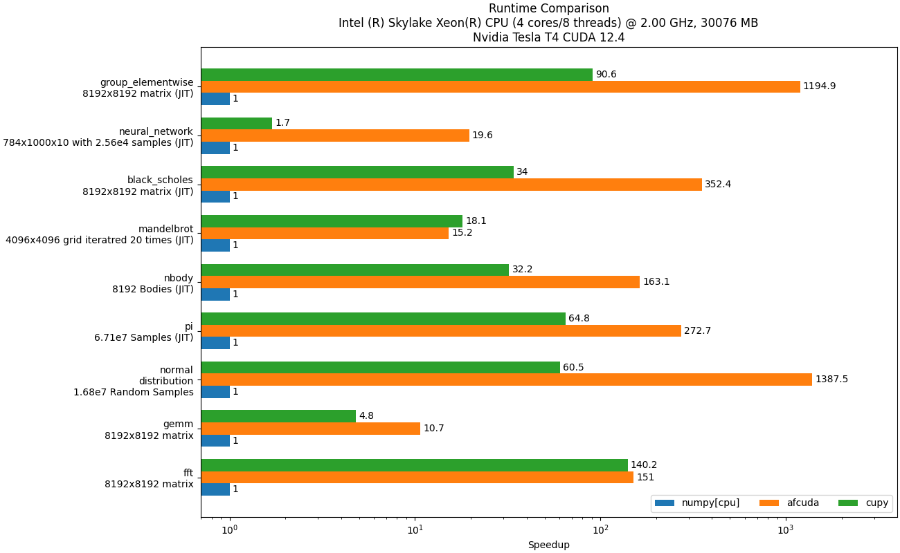
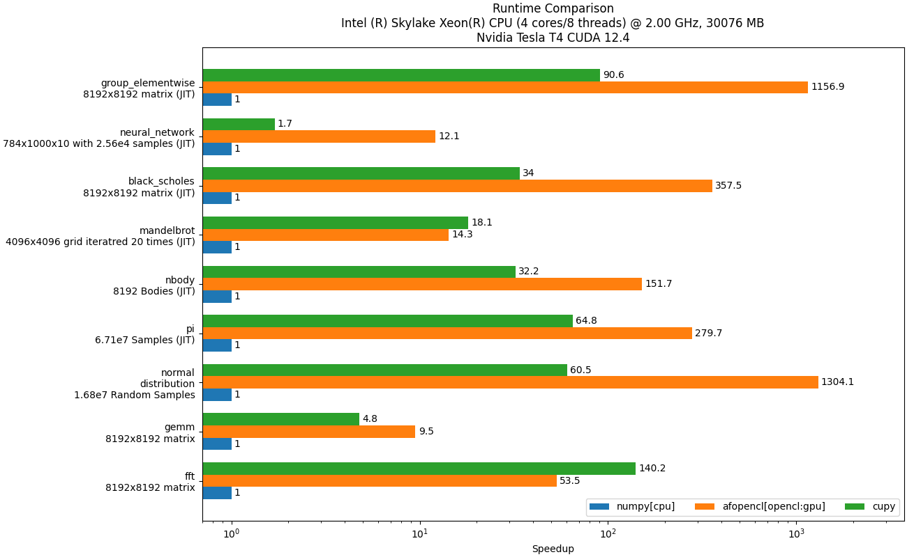
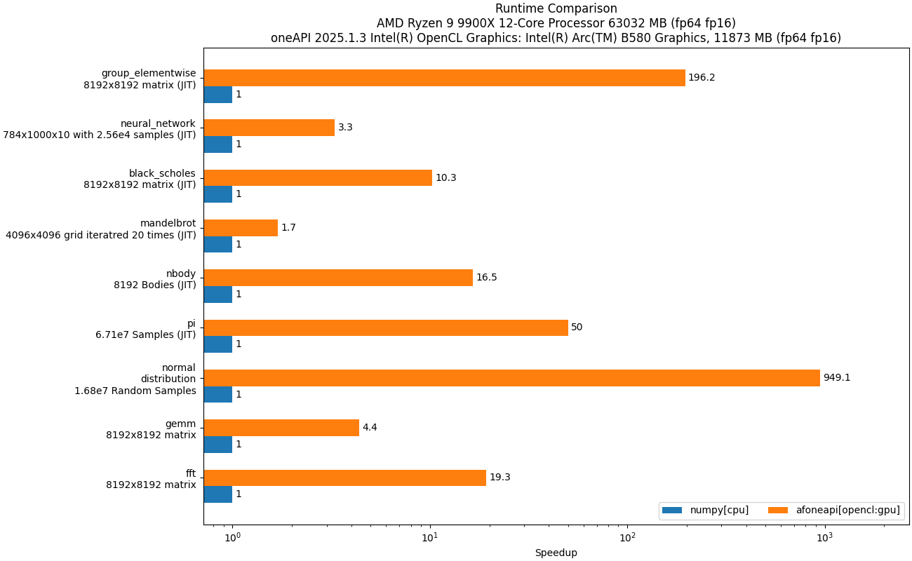

# Benchmarks
Here are some graphs comparing ArrayFire Python against other packages for some common operations:

</a>

</a>

</a>

These graphs were generated with this benchmark code using the ArrayFire C Libraries v3.10